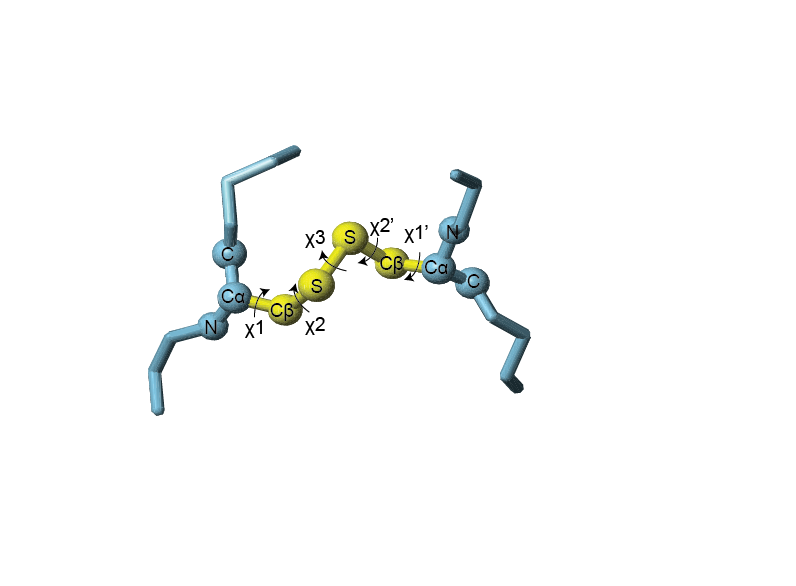
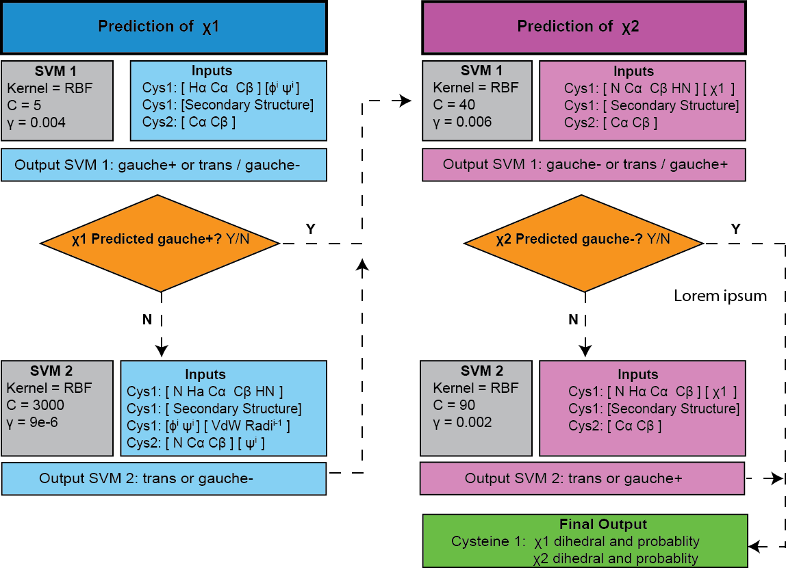

# DISH
DISulfide diHedral prediction

# The Problem
Disulfide bonds (cystines) are essential to the structure and function of disufide rich peptides and proteins. The cysteine side chain can be divided into five dihedral angles and act as cross-beams in a bridge, cross-linking the backbone, influencing the final shape and resulting in a rigid structure. Despite their importance, when resolving peptide structures by nuclear magnetic resonance (NMR) almost no information can be derived about the cystine dihedrals.  
  
  
  

# DISH
DISH is a two stage support vector machine (SVM) that predicts the χ1 and χ2 angles of cystine angles based on chemical shift and structural inputs. The workflow is defined below

  

# Installation
For Linux based distributions.

Clone the repository;
``` 
git clone https://github.com/davarm/DISH_prediction
``` 
Install the required dependencies;

``` 
pip install –r requirements.txt
``` 

Test the program;

``` 
python DISH_prediction.py 2n8e
``` 

**** IMPORTANT *****
The SVMs are saved as pickle objects, for this to work you must have the same version of sklearn. If this is not the case, you will see a warning that will look something like below:
```
UserWarning: Trying to unpickle estimator SVC from version 0.18.1 when using version 0.18.2. This might lead to breaking code or invalid results. Use at your own risk
```

****

To fix this, you must re-compile the SVMs with the current version. 

``` 
cd compile_SVMs
python compile.py
``` 

# Using DISH

The inputs uses adjusted chemical shifts as well as predicted backbone dihedral angles from the Talos-N program (Shen and Bax, 2013). Ensure the directory output from Talos-N (with the predAdjCS.tab and pred.tab files). To this directory, add a text file called ‘connectivity.txt’ and define the cysteine parings as below:

```
8:20  
15:26  
1:6  
```

Run the ‘generating_DISH_inputs.py’ that will collate required information. Will save this as ‘DISH_inputs.csv’ in the Talos-N directory:
``` 
python generating_DISH_inputs.py 2n8e
``` 
Run DISH prediction:

``` 
python DISH_prediction.py 2n8e
``` 
